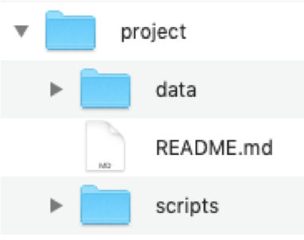
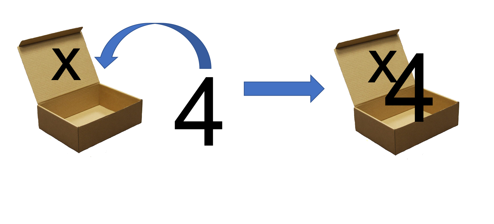
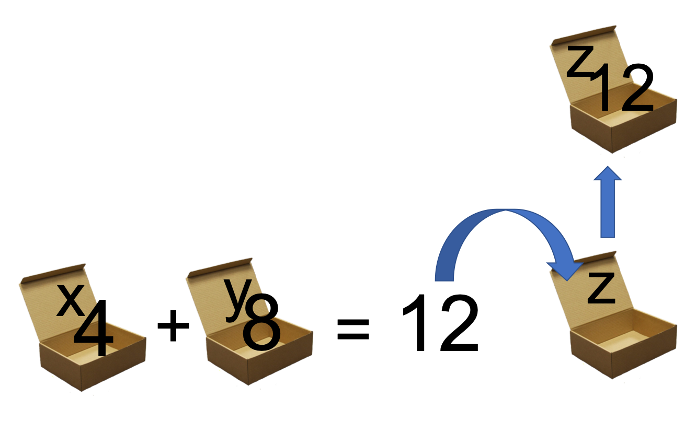
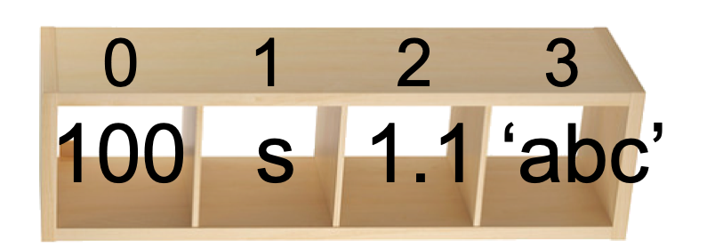

---
title: Welcome to GS 373!
author: Quiz Section 1
date: 2019-04-04
...

# About me
**Sarah Hilton**, 4th year PhD student in Genome Sciences

**email**: skhilton@uw.edu

**office hours**: Wednesdays after lecture

My research focuses on modeling viral evolution (influenza virus) using molecular phylogenetics methods. (substitution matrices)

# Quiz Section goals
- Solidify in-class material (please ask me questions!)  
- Develop understanding of programming concepts.  
- Learn some basic python to write bioinformatics programs.  

*Attendance is not required but the material covered is required.*

# Quiz section website

[`skhilton.github.io/genome373`](https:skhilton.github.io/genome373)

# Homework policies

- Homework is assigned on Friday and is due the *following* Friday by 1:30pm. Assignments will be posted on canvas and the quiz section website.
- Grading is based on *effort* as well as *execution*.
- There are a total of **nine** homework assignments. We will drop the lowest homework grade.
- No late assignments will be accepted.
- First assignment will be posted tomorrow.


# Homework policies

- Use resources wisely. It is fine to google/work in groups but don't copy!
- Don't use python modules that are obvious "shortcuts". Rule of thumb: don't use any modules we haven't used in class.
- The course is taught in `Python3`. Please submit your homework in python3 (see me if you have issues)

# questions about course logistics?

# Today's goals

1. Review Alignments
2. Algorithms and programs, what and why?
3. Programming in `Python`

# 1. Alignments{data-background-color="#9fc5e8"}

# What is an alignment?

> **Arrangement** of nucleotide (or amino acid) sequences, to **identify regions of similarity** that may be a consequence of **functional, structural, or evolutionary relationships** between the sequences.

<div class="fragment">
```
G – A A T T C A G T T A  
|     |   | |   |     |  
G G – A – T C – G - - A  
```
</div>

<div class="fragment">
What does the `|` mean?  
What does the `-` mean?  
</div>

# What are some reasons to align sequences?

- Homologs: descendants of the same ancestral gene  
- Orthologs: homologs that arose via speciation. Often have the same function.
- Paralogs: homologs that arose via gene duplication. Often will have different functions or one will be non-functional.

# Score this alignment
<div class="column" style="float:left; width: 70%">
```
C G G A A T C C  
| |   |   | | |  
C G - A - T T C  
```
</div>
<div class="column" style="float:left; width: 30%">
{height=300px}
</div>

<div class="fragment" style="color:#B22222">
10 + 10 + -4 + 10 + -4 + 10 + 0 + 10 = 42
</div>

# 2. Programming + Algorithms{data-background-color="#f9cb9c"}

# Notes on programming

This class is designed for you for you to learn how to **think programmatically**, use **bioinformatics algorithms**, and learn some **basic programming skills**.

<div class="fragment">
This means that you won't have to implement every algorithm you learn but you will have the building blocks to think through/code other algorithms in the future.
</div>

# Notes on programming

<div class="fragment">

### If you have **previous** programming experience:    
- **Great!** Make sure you understand how to program well `Python3` to understand class topics and complete homework assignments/tests.
</div>

<div class="fragment">
### If you have **no previous** programming experience:  
- **Great!** We will start at the beginning. However, most people learn programming best by doing and we will move quickly. [codeacademy.org](https://www.codecademy.com/)
</div>

# Algorithms

> A set of detailed instructions that solve a problem/accomplish a task

<div class="fragment">
<div class="column" style="float:left; width: 50%">
**Example:** Cook pasta
</div></div>
<div class="fragment">
<div class="column" style="float:left; width: 50%">
**Algorithm:**  
1. Fill pot with water    
2. Put on the stove  
3. Turn stove to high  
4. While water is not boiling:  
       - Wait  
5. Add pasta to water stir  
6. Wait 8 minutes  
</div></div>

# Good algorithm properties

- Unambiguously defined series of steps
- Works for all inputs of a defined set
- Is guaranteed to produce a correct result for those inputs

Often written in “pseudocode"

# Pseudocode example
Given three numbers, find the largest

`input`: ?  
`output`: ?

`pseudocode`: ?

# Pseudocode example
Given three numbers, find the largest

input: three numbers A, B, and C  
output: the largest number  

<div style="line-height: 0.9em; font-size: 60%;">
```python
current_largest = A
if B > current_largest:
	current_largest = B
if C > current_largest:
	current_largest = C
return current_largest
```
</div>

# What is a program?
> A series of instructions that performs a specific task when executed by a computer

Coding/implementation is translating from pseudocode to a language the computer can understand (`Python`).

# 3. Intro to programming in `Python`.{data-background-color="#d9d2e9"}

# lets write our first program!

[Hello, World!](https://en.wikipedia.org/wiki/%22Hello,_World!%22_program)

# (1) Write a script

# Open a text editor

## On Windows

[Notepad++](https://notepad-plus-plus.org/)  
[Sublime Text](https://www.sublimetext.com/3)

## On Mac

[Atom](https://atom.io/)  
[TextWrangler](https://www.barebones.com/products/textwrangler/)  
[Sublime Text](https://www.sublimetext.com/3)  

# `my_first_program.py`

```python
print("Hello, World!")
```

# (2) Command line navigation

# Command line navigation  

<div class="column" style="float:left; width: 60%; font-size: 40%">

Goal|Mac or Unix |Windows|output | location (start in "project")
------------------|------|------|-------------|----------|----------|
|- see where you are  |`pwd` | `cd`  | project  |/Users/sarah/project|
|- see what's in your current directory   | `ls` | `dir`  | "data/", "script/", "README.md"| project|
|- move down into a directory   |  `cd data` | `cd data`  | no output |project/data|
|- move up one level   | `cd ..` | `cd ..`  | no output| project  |
</div>
<div class="column" style="float:left; width: 40%">

</div>

# Navigation resources

## Mac / Unix
[https://swcarpentry.github.io/shell-novice/02-filedir/index.html](https://swcarpentry.github.io/shell-novice/02-filedir/index.html)

## Windows
[https://www.cs.princeton.edu/courses/archive/spr05/cos126/cmd-prompt.html](https://www.cs.princeton.edu/courses/archive/spr05/cos126/cmd-prompt.html)

# (3) Running the script

# Running script on the command line

1. Navigate to your file. (you should see `my_first_program.py` when you type `ls`)  
2. Run. (`python my_first_program.py`)

<div class="fragment">
What's the output on your screen?
</div>

# Coding basics: variables + conditionals

# Assign a value to a variable

```python
x = 4  # line of code
```

### *vocab*  
name: `x`  
value: `4`  
operator(assign): `=`

# Assign a value to a variable

<div class="column" style="float:left; width: 50%">
```python
x = 4
```
</div>
<div class="column" style="float:left; width: 50%">
{height=300px}
</div>

# Assign a value to a variable

<div class="column" style="float:left; width: 40%">
```python
y = 8  
z = x + y
```
</div>
<div class="column" style="float:left; width: 60%">
{height=500px}
</div>

# Variable types
Variable values can be
<div style="line-height: 0.9em; font-size: 38%;">
```python
# integer
x = 1

# float (with decimals)
x = 1.12

# character (single character)
x = 'a'

# string (multiple characters)
x = 'abc'

# boolean (True/False)
x = True

# etc, etc, etc.
```
</div>

# Quick comment on comments
- In Python, the comment character is `#`
- Anything after `#` the computer ignores, it’s for the humans
- Comments are important! Why?

# Lists: many-values-in-one  



<div style="line-height: 0.9em; font-size: 38%;">
```python
my_list = [100, 's', 1.1, 'abc']

print(my_list[0])

print(my_list[1])

print(my_list[3])
```
</div>

# Strings: lists of characters


<div style="line-height: 0.9em; font-size: 38%;">
```python
my_string = "moo!"

print(my_string[0])

print(my_string[1])

print(my_string[3])
```
</div>

# Boolean operators + expressions
> "A Boolean expression ... produces a Boolean value when evaluate, that is one of true or false." [wikipedia.org/wiki/Boolean_expression](https://en.wikipedia.org/wiki/Boolean_expression)

*Asks `True`/`False` questions*

# Boolean operators + expressions examples

<div style="line-height: 0.9em; font-size: 50%;">
```python
x = 4  # assignment! not boolean

x == 4  # True
x != 4  # False (not equals to)

x > 4  # False
x <= 4  # True
```
</div>

# Simple Boolean arthimetic: `and` + `or`

<div style="line-height: 0.9em; font-size: 42%;">
```python

True and True  # True
False and False  # False
True and False  # False

True or True  # True
True or False  # True
False or False  # False

x = 4
x == 4 and x != 3  # True
x != 4 or x != 2  # True
```
</div>

# Conditionals: `if`, `else`, `elif`

> Conditionals (flow control) determines which lines the computer looks at in the code.

In `Python`: `if` / `elif` (else if) / `else`

# Conditionals: `if`, `else`, `elif`

<div style="line-height: 0.9em; font-size: 34%;">
```python
x = 4

# if statement
if x == 4:
    print("x is 4")

# if / else statement
if x == 4:
    print("x is 4")
else:
    print("x is not 4")

# if / elif / else statement
if x == 4:
    print("x is 4")
elif x > 4:
    print("x is greater than 4")
else:
    print("x is less than 4")
```
</div>

# Watch out!

```python
if x == 4:
    print("x is 4")
```
*You must include the `:`.
Lines "under" the conditional must be tabbed (or 4 spaces) over.*

# Summary

## variables
- name, value
- assignment operator `=`
- lists can store many values

## conditionals
- flow control
- use Boolean expressions (`True`/ `False`)
- `if` / `elif` / `else`

# questions? skhilton@uw.edu{data-background-color="#b6d7a8"}

# Week 1 tips + tricks
- The biggest difference (for you) between `Python2` and `Python3` is how the `print` function works. Watch out for this! To print in `Python3`: `print("hello, world!")`
- In Python, `x = 4` assigns the value `4` to the variable `x`. `x == 4` is a boolean expression. If `True` then the value of `x` is `4`, if `False` then the value of `x` is not `4`.
- `Python` is `0` index. The first element in a list is element `0`.
- White space matters! Don't mix tabs and spaces.
