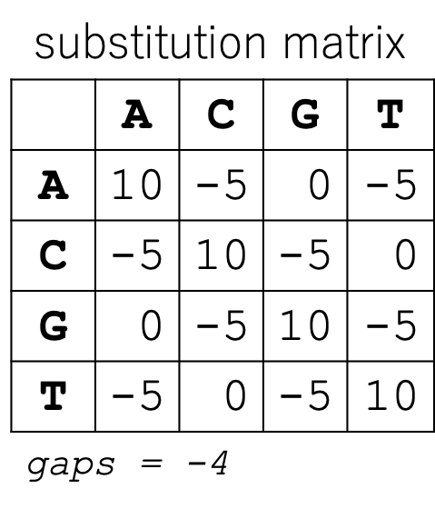
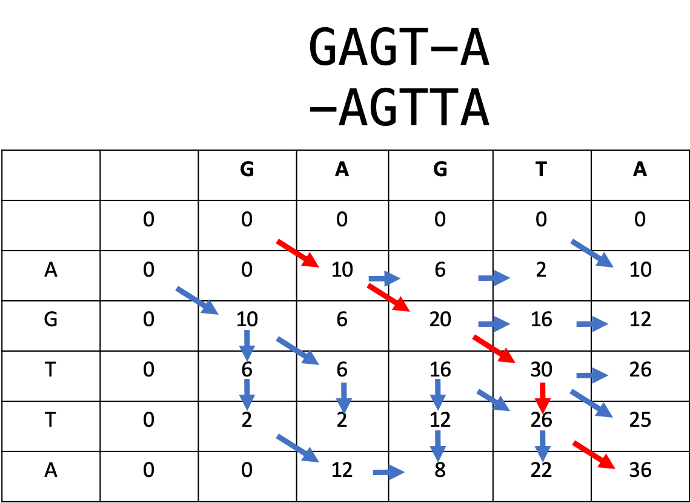
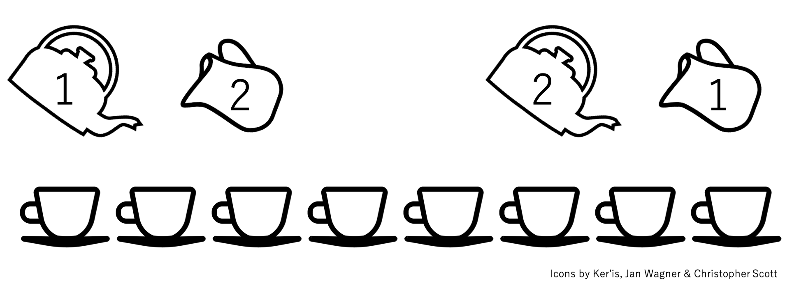
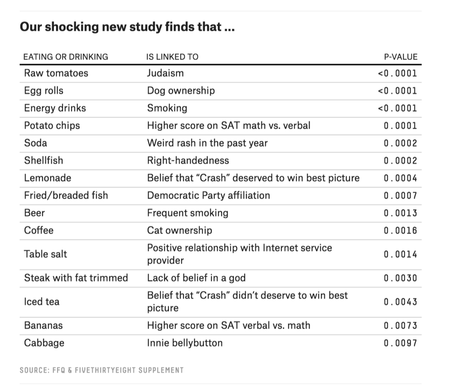

---
title: Quiz Section 2
author: Local alignments, P-values, `Python` datatypes
date: 2019-04-11
...

# Agenda

1. Review Dynamic Programming algorithm
2. Statistics: pvalues and multiple hypothesis testing
4. More `Python`

# 1. Dynamic Programming{data-background-color="#9fc5e8"}

# Local alignment

* Please split into three groups  
* Implement the Smith-Waterman algorithm on the board  
* Report back your highest scoring local alignment  

# Local alignment data

Please align `GAGTA` and `AGTTA`

<div class="column" style="float:left; width: 50%">

{height=300px}

</div>
<div class="column" style="float:left; width: 50%">

</div>

# Solution

{height=500px}

# 2. P-values{data-background-color="#f9cb9c"}

# What do P-values tell us?

- P-values tell you about expectations *under the null hypothesis*
- The null hypothesis is usually the *boring default*, the *devil's advocate position*, or *what you want to see if you can disprove*.
- Examples of null hypotheses: "there is *no* difference between treatment groups", "life expectantancy *is not* changing over time, the coin *is not* weighted, the two sequences are *unrelated*.

# What *don't* P-values tell us?
- P-values say nothing about the alternative hypothesis or how probable it is.
- "We reject the null hypothesis" or "We fail to reject the null hypothesis"

# ["lady tasting tea" test](https://en.wikipedia.org/wiki/Lady_tasting_tea)


# Null distribution

What the data may look like if the null distribution is true.
*How many guesses would be correct if the guess were random?*

## (1) Parametrized probability distribution
For the lady tasting tea test, this was a hypergeometric distribution  
*What are some other distributions?*  

## (2) Empirical null based on the real data
Shuffle the labels on your data

# How do you define your null distribution?

Defining the most appropriate null distribution is a relevant and tough problem in a lot of computational biology!

# Multiple hypothesis testing is dangerous!

<div class="column" style="float:left; width: 50%">

[FiveThirtyEight analyzed nutritional and lifestyle surveys from 54 individuals.](https://fivethirtyeight.com/features/you-cant-trust-what-you-read-about-nutrition/)  

</div>
<div class="column" style="float:left; width: 50%">
{height=500px}
</div>

# Multiple hypothesis correction

## Bonferonni correction
For `n` tests, use a threshold that is `n`X stricter. (Divide your cutoff by `n`)

## False discovery rate
Sometimes a Bonferonni correction is too harsh. Then, a false discovery rate correction may be more useful.

# 3. `Python` - datatypes.{data-background-color="#d9d2e9"}

# Variables and types

### Python has **five** built-in data types
- Number
- String
- List
- Tuple
- Dictionary

<div class="fragment">
### You can find an object's type using the type function.
```python
x = 5
type(x)
```
</div>

# Numbers

- The type number has two subtypes: integers (`int`) and floats (`float`)
- integer division is one of the changes between `Python2` and `Python3`
- To explicitly changes between types, use `int()` and `float()`. ex) `x = float(x)` will turn x into a `float`.

# Operators

`Python` operator | operation | example
---|---|---|
|`**`   |exponentiation   | 3**2 = 9  |
|`* `  | multiplication  | 4*2 = 6  |
|`/ `  | division  | 4/2 = 2  |
|`+ `  | addition | 4+4 = 8  |
|`-`   | subtraction  | 3-2=1  |

Remember PENDAS?  
*2\*3\*\*2 = ?*

# Strings

- A series of characters starting or ending with single or double quotes.
- Stored a a list of characters in memory.
- `mystring = "GATTACA"`

<div class="fragment">
0|1|2|3|4|5|6|
---|---|---|---|---|---|---|
|G   |A   |T   |T   |A   |C   |A   |  
</div>

# Accessing strings: indices and splices
- You can reference a single character using its **index**  
- You can reference a range of characters by creating a **splice**. The first number is **inclusive** and the second number is **exclusive**.

# Accessing strings: indices and splices

command|`G`|`A`|`T`|`T`|`A`|`C`|`A`|result
---|---|---|---|---|---|---|---|---|
s[0]|X   |   |   |   |  |   |  |`G`
|s[:3]   |  X | X  |  X |   |   |   |   |`GAT`
|s[4:]   |   |   |   |   | X  | X  | X  |`ACA`
|s[3:5]   |   |   |   | X  |  X |   |   |`TA`
|s[:]   | X  |  X |  X |  X |  X | X  |  X |`GATTACA`

# String functionality (built-in functions)
<div class="fragment" style="font-size: 50%;">
```python
len("GATTACA")  # 7

"GAT" + "TACA"  # GATTACA

"A" * 10  # AAAAAAAAAA

"GAT" in "GATTACA"  # True  

"AGT" in "GATTACA"  # False
```
</div>
# Methods

- In `Python`, a method is a function for a particular object type.
- The syntax is `<object>.<method>(<parameters)`

<div class="fragment" style="line-height: 0.9em; font-size: 80%;">
```python
DNA = "AGT"
DNA.find("A")  # 0
```
</div>

# String methods

<div class="fragment" style="font-size: 60%;">
```python
"GATTACA".find("ATT")  # 1
"GATTACA".count("T")  # 2
"GATTACA".lower()  # 'gattaca'
"gattaca".upper()  # 'GATTACA'
"GATTACA".replace("G", "U")  # 'UATTACA'
"GATTACA".replace("C", "U")  # 'GATTAUA'
"GATTACA".replace("AT", "**")  # 'G**TACA'
"GATTACA".startswith("G")  # True
"GATTACA".startswith("g")  # False
```
</div>

# Strings are immutable

 String methods do not modify the string; they return a new string.

<div class="fragment" style="font-size: 60%;">

```python
sequence = "ACGT"
sequence.replace("A", "G")  # 'GCGT'
print(sequence)  # "ACGT"

sequence = "ACGT"
new_sequence = sequence.replace("A", "G")
print(new_sequence)  # 'GCGT'
```
</div>

# Reading input from the command line

- When you type `python sarahs_program.py 2 3`, `Python` sees a list of strings `["sarahs_program.py", "2", "3"]`
- You can access parts of this list using `sys.argv`
- `argv` is a `function` from the module `sys`
- You must `import` `sys` to use this function

# Example of reading input from the command line

`python sarahs_program.py 2 3`

<div class="fragment" style="line-height: 0.9em; font-size: 50%;">

Let's look inside `sarahs_program.py`:

```python
## Inside sarahs_program.py:
# Many functions only available via
# packages, you must import them
import sys
first_num = int(sys.argv[1])
second_num = float(sys.argv[2])
```
</div>

# Sample problem

- Write a program called dna2rna.py that **reads a DNA sequence from the first command line argument, and then prints it as an RNA sequence.**  
- Make sure it works for both uppercase and lowercase input.

<div class="fragment" style="line-height: 0.9em; font-size: 50%;">
```python
> python dna2rna.py  ACTCAGT
ACUCAGU
> python dna2rna.py actcagt
acucagu
> python dna2rna.py ACTCagt
ACUCagu
```
</div>

# Solution
<div style="font-size: 60%;">
```python
import sys  # pull from command line
DNA = sys.argv[1]

# replace T with U (DNA -> RNA)
RNA = DNA.replace("T", "U")
RNA = DNA.replace("t", "u")
print(RNA)

# second solution
RNA = DNA.replace("T", "U").replace("t", "u")
```
</div>

# Sample problem

- Write a program that takes a **DNA sequence as the first command line argument and prints the number of A’s, T’s, G’s, and C’s**

<div class="fragment" style="font-size: 60%;">
```python
python dna-composition.py ACGTGCGTTAC
2 A’s
3 C’s
3 G’s
3 T’s
```
</div>

# Solution

<div style="font-size: 38%";>

```python
import sys

# grab the DNA sequence

DNA = sys.argv[1]

# make it uppercase
DNA = DNA.upper()

# count
A = DNA.count('A')
C = DNA.count('C')
G = DNA.count('G')
T = DNA.count('T')
print("{0} As\n{1} Cs\n{2 }Gs\n{3} Ts".format(A, C, G, T))
```
</div>

# Lists

Lists are an ordered series of objects

<div style="font-size: 58%;">
```python
list1 = ["sarah", "C", 3, 2.4]
list2 = [1, 2, 3]
list3 = [list1, list2]
list3  # [["sarah", "C", 3, 2.4], [1, 2, 3]]
```
</div>

# Unlike strings, lists are mutable

<div style="font-size: 60%;">
```python
list1 = ["sarah", "C", 3, 2.4]
list1[1] = "hilton"
list1  # ["sarah", "hilton", 3, 2.4]
```
</div>

# Expanding lists

<div style="font-size: 60%;">
```python
newlist = []
print(newlist)  # []

newlist.append(4)
print(newlist)  # [4]

newlist.extend([4,5])
print(newlist)  # [4,4,5]
```
</div>

# More list methods
<div style="font-size: 50%;">
```python
# add x to the end of L
L.append(x)  
# add x and y to L
L.extend([x,y])
# count how many times x is in L
L.count(x)  
 # give the location of x
L.index(x)
# remove first occurrence of x
L.remove(x)  
# reverse order of elements of L
L.reverse(x)  
 # sort L
L.sort()
```
</div>

# Sample problem

- Write a program that takes a list of words and prints them out in sorted order

<div class="fragment" style="line-height: 0.9em; font-size: 80%;">
```python
python sort_list.py z y x
['x', 'y', 'z']
```
</div>

# Solution
<div style="font-size: 60%;">
```python
import sys
iList = sys.argv[1:]
iList.sort()
print(iList)
```
</div>


# Tuples

- Tuples are immutable lists. You can't change them in place (like strings)
- If you want to change them, you have to assign them to a new tuple

<div class="fragment" style="line-height: 0.9em; font-size: 60%;">
```python
T = (1,2,3)
T[1] = 1  # Error

T = T + T
T  # (1,2,3,1,2,3)
```
</div>

# More on conditionals
<div style="font-size: 60%;">
```python
DNA = "AGTGGT"
if (DNA.startswith("A")):
    print("Starts with A")
```
</div>

<div class="fragment" style="line-height: 0.9em; font-size: 60%;">
```
if (<test evaluates to true>):
  <execute this block of code>
```
</div>

# More on conditionals
- A block is a group of lines of code that belong together.  
- `Python` uses indentation to keep track of blocks.
- You can use any number of spaces (or a tab) to indicate blocks, but you must be consistent.
- An unindented or blank line indicates the end of a block.
- In interactive mode, the ellipse indicates that you are inside a block.

# Sample problem

- Write a program find-base.py that **takes as input a DNA sequence and a nucleotide.**  The program should **print where the nucleotide occurs in the sequence, or a message saying it’s not there.**


<div class="fragment" style="font-size: 60%;">
```
> python find-base.py A GTAGCTA
A occurs at position 3.
> python find-base.py A GTGCT
A does not occur at all.
```
</div>

# Solution
<div style="font-size: 32%;">
```python
import sys

base = sys.argv[1]
dna = sys.argv[2]

# solution 1
position = dna.find(base)
if position == -1:
  print("{0} does not occur at all.".format(base))
else:
  print("{0} occus in position {1}".format(base, position+1))

# solution 2
if base in dna:
  position = dna.find(base) + 1
  print("{0} occus in position {1}".format(base, position))
else:
  print("{0} does not occur at all.".format(base))
```
</div>

# questions? skhilton@uw.edu{data-background-color="#b6d7a8"}

# Week 2 tips + tricks
- Integer division is different between `Python2` and `Python3`
- `Python3` string formatting looks like this `"{0} {1} {0}".format("hello" "goodbye")` (`"hello goodbye hello"`)
- Strings must begin *and* end with quotes. If you forget, you may get an error like `SyntaxError: EOL while scanning string literal”`
- `Python` is 0 indexed. If `x = ["a", "b", "c"]` and you type `a[3]`, you may get an error like `IndexError: list index out of range`
