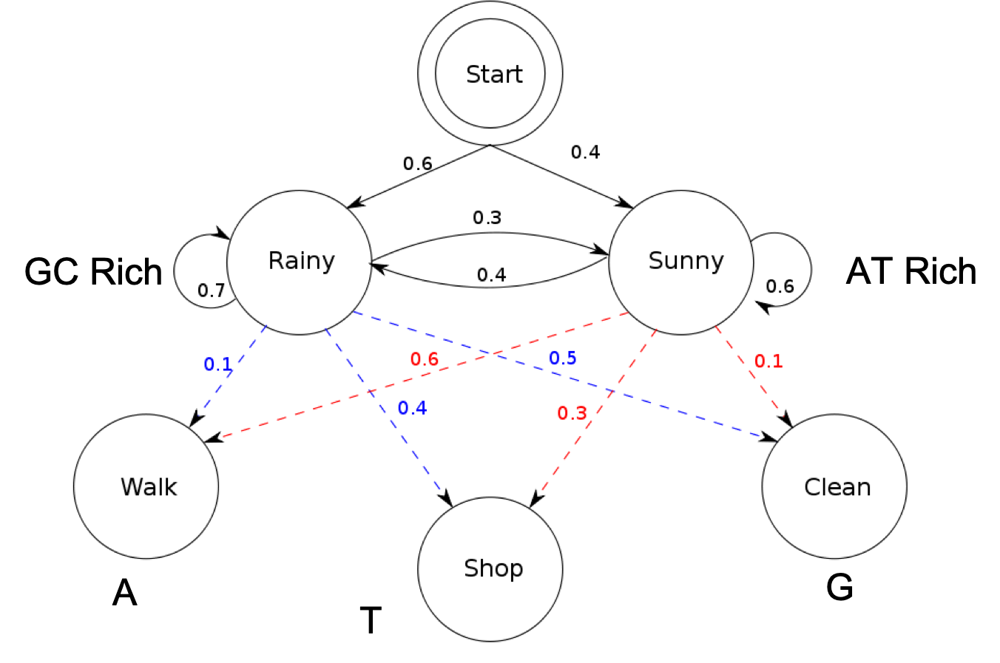

---
title: Quiz Section Week 6
author: HMMs and File I/O
date: 2019-05-09
...

# 1. HMMs{data-background-color="#9fc5e8"}

# Hidden Markov Models (HMMs)

[Wikipedia's example](https://en.wikipedia.org/wiki/Hidden_Markov_model)

**Alice is trying to guess the weather based on Bob's behavior**

Alice has a friend named Bob who lives across the country, and who only likes to do three things: go for a walk, shop and clean the house.
He decides what to do each day depending on the weather

# Bob's behavior and the weather

<div style="fontSize: 80%">
If it’s sunny:  
60% of the time he goes for a walk  
30% of the time he goes shopping  
10% of the time he cleans his house  

If it’s rainy:  
10% of the time he goes for a walk  
40% of the time he goes shopping  
50% of the time he cleans his house
</div>

# Alice's challenge

Bob calls Alice every day and tells Alice what he did that day, but does not tell you the weather. Can Alice predict what the weather is based on what Bob tells her?

* What are the emissions?  
* What are the hidden states?  
* Any other info you need that I haven’t given yet?  

# HMM Visualization

{height=500px}

# Chain rule of probability

P(A) AND P(B) = P(A) * P(B)

_**and** means multiplication_

# 2. Python: File `I/O`{data-background-color="#9fc5e8"}

#  Python's `open` command

* The open() command returns a file object.
`<filehandle> = open(<filename>, <access type>)`

* Python can read, write or append to a file: `r` = read, `w` = write, `a` = append

* Create a file called `hello.txt` containing one line: “Hello, world!”

# Read whole file - string

<div style="font-size: 70%">
```python
my_file = open("hello.text", "r")
my_string = my_file.read()
(print my_string)
```
</div>

*Try adding another line to your file and read it in again*

# Read whole file - list of strings

<div style="font-size: 40%">
```python
my_file = open("hello.txt", "r")
my_string_list = my_file.readlines()
print(my_string_list)  #['Hello, world!\n', "How ya doin'?\n"]
print(my_string_list[1])  # How ya doin'?
```
</div>

# Read in whole file - one line at a time

* The `readlines()` command puts all the lines into a list of strings.
* The `readline()` command returns the next line.

<div class="fragment" style="font-size: 80%">
```python
my_file = open("hello.txt", "r")
my_string = my_file.readline()
print(my_string)
my_string = my_file.readline()
print(my_string)
```
</div>

# Write to a file

<div class="fragment" style="font-size: 50%">
```python
my_file = open("new.txt", "w")  # notice 'w' for write
my_file.write("This is a new file\n")
my_file.close()  # very important!
```
</div>

* `<file>.write()` does not automatically append an end-of-line character.
* `<file>.write()` requires a string as input


# Make sure you "remember" to close a file object

<div class="fragment">
... or let a `while` loop do that for you!
</div>

<div class="fragment" style="font-size: 60%">
```python
with open("new.txt", "w") as f:  # notice 'w' for write
    f.write("This is a new file\n")
```
</div>

# Quick reference

<div style="font-size: 60%">
```python
<file> = open(<filename>, r|w|a)
<string> = <file>.read()
<string> = <file>.readline()
<string list> = <file>.readlines()
<file>.write(<string>)
<file>.close()
```
</div>

# Sample problem # 1

Write a program `read-first-line.py` that takes a file name from the command line, opens the file, reads the first line, and prints the result to the screen.

<div style="font-size: 60%">

```python
> python read-first-line.py hello.txt
Hello, world!
```
</div>

# Using a loop to iterate through lines

<div style="font-size: 40%">
```python
with open('hello.txt', 'r') as f:
  all_lines = []
  for line in f:
    all_lines.append(line)
print(all_lines)
```

# Getting rid of "new line" characters

<div style="font-size: 60%">
```python
my_open_file = open(sys.argv[1])
s1 = my_open_file.readline().strip()
s2 = my_open_file.readline().strip()
```
</div>

*note: if you are in a different directory than the file, you must supply the **file path***

# Sample problem # 2

write a program to calculate and write to a file the # of times a start codon occurs in each sequence

Use this function  
<div style="font-size: 50%">
```python
def count_start_codons(seq):
	num_starts = seq.count("ATG")
	return num_starts
```
</div>

file should look like this:  
```
ATGGGGGATG	2  
CAGTTATGCCT	1
```

# Scope of a variable

* Variables created in the main part of your program can be accessed anywhere (global scope)  
* Variables created within functions are only accessible within that function (local scope)  

# Scope example

<div style="font-size: 60%">
```python
new_list = [0,1,2]
def less_than(myList, num = 4):
	new_list = []
	for x in myList:
		if x < num:
			new_list.append(x)
	return new_list

print(new_list)
anotherList = [3,7,12]
print(less_than(anotherList))
```
</div>

# that made me so nervous!!

# Coding good practice

* Define all functions at the top of the file
* Think about local vs. global variable names (generic vs. specific)

* This helps you from getting confused and helps others when they try to read your code!

# Scope example (take 2)

<div style="font-size: 60%">
```python
def less_than(myList, num = 4):
	final_list = []  # diff variable name
	for x in final_list:
		if x < num:
			final_list.append(x)
	return final_list

new_list = [0,1,2]
print(new_list)
anotherList = [3,7,12]
print(less_than(anotherList))
```
</div>
