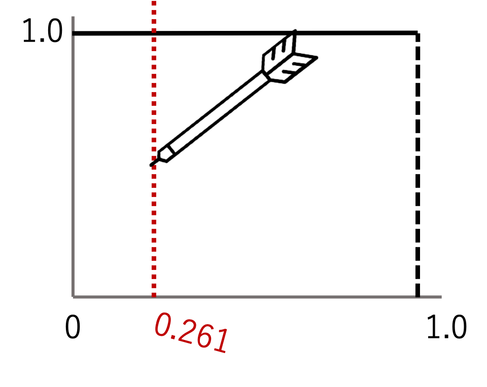
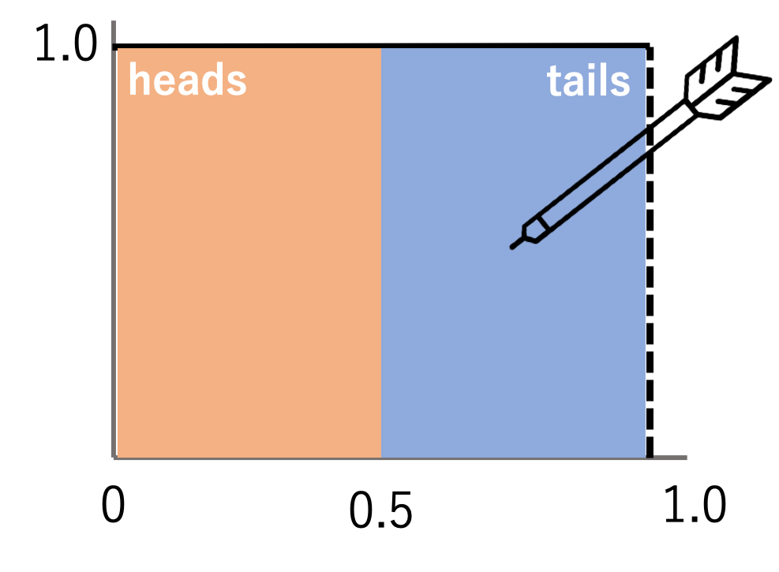

---
title: Quiz Section Week 7
author: more functions!
date: 2019-05-16
...

# Python 1: random numbers {data-background-color="#9fc5e8"}

# Why would we want random numbers in our analysis?

#


# Why would we want random numbers in our analysis?

- random sequences for null distribution in a sequence alignment
- A Markov chain that changes states probabilistically
- allele frequencies in a pop gen simulator

# `Python` module `random`

The `random` function of the `Python` module `random` returns a uniformly distributed random value between 0 and 1.

```python
import random
r = random.random()
print(r)
0.261256363123
```

# Uniform distribution

{height=500px}

# How can we use random numbers to simulate coin flips?

# Modeling two equally probable choices

{height=400px}

# code

<div class="fragment" style="font-size: 60%;">
```python
import random

# return heads or tails
def coinflip():
    f = random.random()
    if f > 0.5:
        return "T"
    else:
        return "H"
```
</div>

# Simulation test

# How could we use random numbers to simulate a dice roll?

# How "random" are we talking?

***pseudorandom***  

`random.random()` *approximates* random number generation based on a starting point – a seed.
If you want to reproducibly produce the same “random” set of numbers twice, you can set the seed with `random.seed(100)`

# Why use a seed?

- When running an analysis with any sort of randomness, you want to set a seed so your results are reproducible.
- You should also run the analysis on _multiple_ seeds to make sure the results are robust

# Python 2: returning values {data-background-color="#9fc5e8"}

# Why use functions?

# What does this function do?

<div style="font-size: 50%">
```python
def CalcSum(a_list):
	sum = 0
	for item in a_list:  
		sum += item
	return sum
```
</div>

<div class="fragment" style="font-size: 50%">
```python
>>> my_list = [1, 3, 2, 9]
>>> print(CalcSum(my_list))
15
```
</div>

# Returning multiple values

modify the code to return the product and the sum  

<div class="column" style="float:left; width: 40%; font-size: 40%">
```python
def CalcSumAndProd(a_list):  
	sum = 0
	prod = 1
	for item in a_list:  
		sum += item  
		prod *= item
	return [sum, prod]
```
</div>

<div class="column" style="float:left; width: 60%; font-size: 40%">
```python
>>> my_list = [1, 3, 2, 9]
>>> res = CalcSumAndProd(my_list)
>>> print(res)
[15, 54]
```

```python
>>> my_list = [1, 3, 2, 9]
>>> [s, p] = CalcSumAndProd(my_list)
>>> print(s)
15
```
</div>

# Returning lists

<div style="font-size: 50%">
```python
def incrementEachElement(a_list):  
	new_list = []
	for item in a_list:  
		new_list.append(item+1)
	return new_list

# use function
my_list = [1, 20, 34, 8]
print(my_list)
my_incremended_list = incrementEachElement(my_list)
print(my_incremended_list)
```
</div>

- uh oh! What could cause a problem here?

# Returning lists (modified)

<div style="font-size: 50%">
```python
def incrementEachElement(a_list):  
	new_list = []
	for item in a_list:  
		new_list.append(item+1)
	return new_list

# use function
my_list = [1, 20, 34, 8]
print(my_list)
my_list = incrementEachElement(my_list)
print(my_list)
```
</div>

# What's going to happen?

<div style="font-size: 50%">
```python
def incrementEachElement(a_list):
    for index in range(len(a_list)):
        a_list[index] +=1

# use function
my_list = [1, 20, 34, 8]
print(my_list)
incrementEachElement(my_list)
print(my_list)
```
</div>

# If that works, why doesn't this?!?

<div style="font-size: 50%">
```python
def doubleup(a_string):
    a_string = a_string + a_string

# use function
my_string = "hello"
print(my_string)
doubleup(my_string)
print(my_string)
```
</div>

# What's the difference between lists and strings/tuples?

# pass-by-value vs. pass-by-reference

Calling strategies

<div style="font-size: 65%">
**pass-by-value**    
- The value of the argument is copied into a local variable  inside the function  
- C, Scheme, C++

**pass-by-reference**  
- The function receives an implicit reference to the variable
used as argument, rather than a copy of its value  
- "reference" means location in memory  
- Perl, VB, C++  

</div>

Which one is python?

# Will this affect _my_ code?

**It could help!**  
- Handling large datasets  
- "in place" changes make sense  

**It could cause problems!**    
- don't lose the reference!   
- don't change an argument by mistake   
- (good place to start debugging)  

# Python 3: arguments {data-background-color="#9fc5e8"}

# required arguments

What are the arguments in this function?

<div style="font-size: 50%">
```python
def printMulti(text, n):
	for i in range(n):  
		print(text)
```
</div>

<div class="fragment" style="font-size: 50%">
What happens if we call   
```python
printMulti("blah", 4)
```
</div>

<div class="fragment" style="font-size: 50%">
What happens if we call  
```python
printMulti("blah")
```
</div>

# default arguments

<div style="font-size: 50%">
```python
def printMulti(text, n=3):
	for i in range(n):  
		print(text)
```
</div>

<div class="fragment" style="font-size: 50%">
```python
>>> printMulti(“Bla”,4)
Bla  
Bla  
Bla  
Bla
```
</div>

<div class="fragment" style="font-size: 50%">
```python
>>> printMulti(“Yada”)  
Yada
Yada
Yada
```
</div>

# default arguments

Default arguments are useful when you have _many_ arguments, most of which will not be changed by the user

<div class="fragment" style="font-size: 40%">
```python
def runBlast(fasta_file, costGap=10, E=10.0, desc=100,
            max_align=25, matrix=“BLOSUM62”, sim=0.7, corr=True):
	<runBlast code here>
```
</div>

<div class="fragment" style="font-size: 50%">
```python
>>> runBlast(“my_fasta.txt”)
```
</div>

<div class="fragment" style="font-size: 40%">
vs

```python
>>> runBlast(“my_fasta.txt”, 10, 10.0, 100, 25, “BLOSUM62”, 0.7,  True)
```
</div>

# keyword arguments

<div style="font-size: 50%">
```python
def runBlast(fasta_file, costGap=10, E=10.0, desc=100,  
						max_align=25, matrix=“BLOSUM62”, sim=0.7, corr=True):
	<runBlast code here>
```

```python
>>> runBlast(“my_fasta.txt”, matrix=“PAM40”)
```
</div>

# questions? skhilton@uw.edu {data-background-color="#9fc5e8"}
