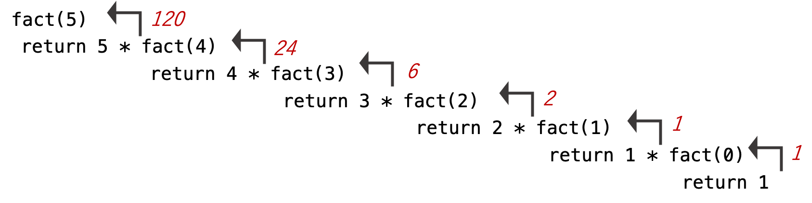

---
title: Quiz Section Week 8
author: recursion
date: 2019-05-23
...

# recursion {data-background-color="#9fc5e8"}

# Recursion

> a recursive algorithm or function is one that calls itself

# Ex) calculate a factorial

n! = n * (n-1) * ... * 2 * 1

# non-recursive function

<div style="font-size: 80%">
```python
def factorial(n):
  f = 1
  for in in range(1, n+1):
    f *= i
  return f
```
</div>

# recursive function

<div style="font-size: 80%">
```python
def factorial(n):
  if n == 0:
    return 1
  else:
    return n * factorial (n-1)
```
</div>

*what make's this function recursive?*  

# factorial example flow chart



# base case

- bases cases are easily computed expression on which *no* recursion is called.
- in the factorial example, when `n == 0`

# Key features of a recursive algorithm

1. there are one more base cases for which no recursion is applied
2. all recursion chains end up at one or more base cases

# merge-sort

**objective** sort a list of numbers (pile of index cards)

1. split cards into two halves
2. sort 1st half (using merge-sort)
3. sort 2nd half (using merge-sort)
4. merge halves

*what is the base case?*  
*what is efficient about the merge step?*  

# recursion takeaways

- tool in your problem solving toolbox
- natural and/or elegant solution
- costly overhead to call a function
- often loops are preferred

# [merge-sort pseudocode]((https://interactivepython.org/runestone/static/pythonds/SortSearch/TheMergeSort.html))

<div style="font-size: 20%">
```python
def mergeSort(alist):
    print("Splitting ",alist)
    if len(alist)>1:
        mid = len(alist)//2
        lefthalf = alist[:mid]
        righthalf = alist[mid:]

        mergeSort(lefthalf)
        mergeSort(righthalf)

        i=0
        j=0
        k=0
        while i < len(lefthalf) and j < len(righthalf):
            if lefthalf[i] < righthalf[j]:
                alist[k]=lefthalf[i]
                i=i+1
            else:
                alist[k]=righthalf[j]
                j=j+1
            k=k+1

        while i < len(lefthalf):
            alist[k]=lefthalf[i]
            i=i+1
            k=k+1

        while j < len(righthalf):
            alist[k]=righthalf[j]
            j=j+1
            k=k+1
    print("Merging ",alist)

alist = [54,26,93,17,77,31,44,55,20]
mergeSort(alist)
print(alist)
```
</div>
