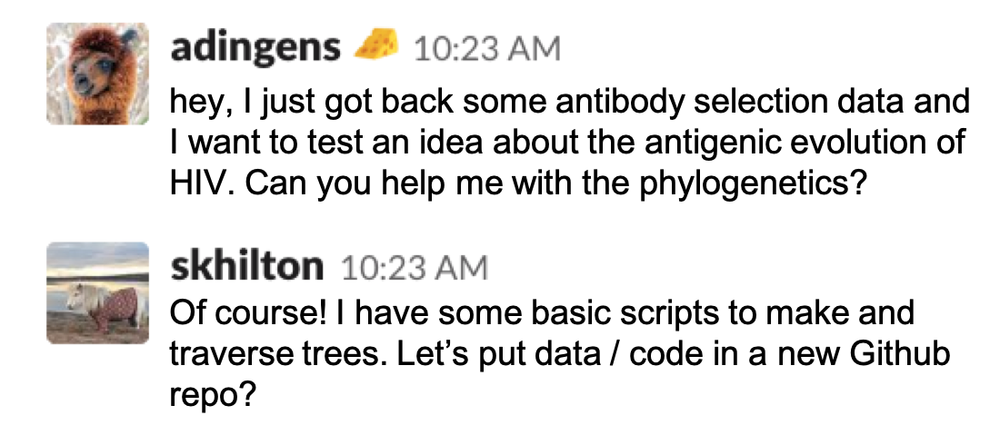
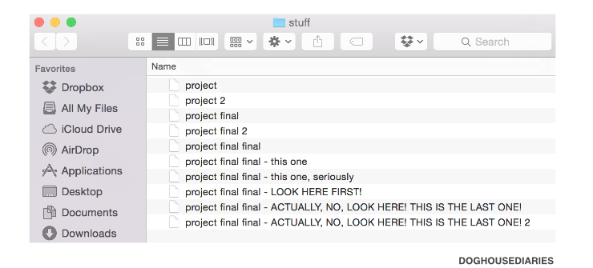

---
title: Quiz Section Week 9
author: comp bio tools
date: 2019-05-30
...

# practical computing

# version control / `git` {data-background-color="#9fc5e8"}

# why version control?

# why version control?

- facilitate collaboration
- restore previous versions
- backup your work
- track your code as your write it

# `git` vs. `Github`

- `Git` is the version control software - it’s the software keeping track of the changes/versions
- `Github` is a website that allows you to store the version information off your computer
- `Github` users have IDs (ex. skhilton)
- `Github` accounts are free

# `Github` website vocab

- users
- repos

# `clone`, `push`, `pull`

**vocab**   
remote, local

[source](https://infx-web-win17.github.io/tutorials/managing-files/)

# how to clone a repo

`git clone <repo address>`

# common sequence of commands

**adding local files to remote repo**  
`git status`

`git add <file name>`

`git commit -m "descriptive message"`

`git push`

**pulling files from remote repo to my local repo**

`git pull`

# Want to test `Github` out?

- create an account `github.com`  
- create a repo called `homework9`
- feel free to email me with questions if you need help cloning/adding/pushing

# a (forever?) learning curve

{height=500px}

# package managers {data-background-color="#f9cb9c"}

# what is a package manager?

> tool that allows you to install and manage additional libraries not part of a standard distribution

- what are some standard libraries we have used this quarter?

# what is the `python` package manager?

[`pip`](https://pypi.org/project/pip/)!

# how to use pip

`pip --version`

`pip install <package name>`

`pip install --upgrade <package name>`

# what are some modules you may want to install right now?

- [`pandas`](https://pandas.pydata.org/)
- [`numpy`](https://www.numpy.org/)
- [`scipy`](https://www.scipy.org/)
- [`BioPython`](https://biopython.org/)
- [`scikit-learn`](https://scikit-learn.org/stable/)

# redo of hw6 with `BioPython`

[github link](https://github.com/skhilton/hw6-redo)

# environments {data-background-color="#d9d2e9"}

# what is anaconda / conda / miniconda?

[anaconda](https://www.anaconda.com/distribution/)

> cross platform package and environment manager

# ...

"it's like `pip` for non-`python` things and pip for `python` things and more"

# what's the difference between `anaconda` and `pip`?

> This highlights a key difference between conda and pip. Pip installs Python packages whereas conda installs packages which may contain software written in any language... Another key difference between the two tools is that conda has the ability to create isolated environments that can contain different versions of Python and/or the packages installed in them.

# what is an environment?

- environments allow you to specify *exact* versions of software and specify dependencies
- environments are helpful when you are developing software or starting a new project because you get a "clean slate"

# summary {data-background-color="#9fc5e8"}

# Programming as a computational biologist

- your code should be available to others (`Github`)  
- your code should be understandable to others (documentation!)
- your code should be runnable by others (this is very hard!)  
- be conscious of when you should implement something yourself (more control) and when you should use preexisting packages (don't reinvent the wheel)

# call for questions for the review session {data-background-color="#9fc5e8"}
